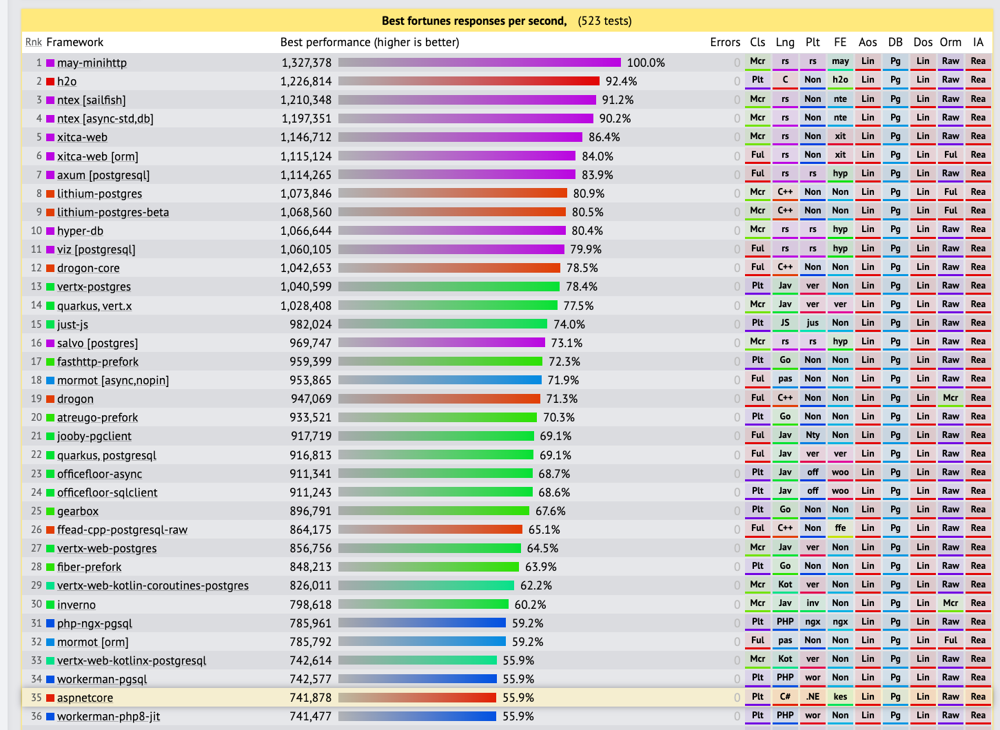
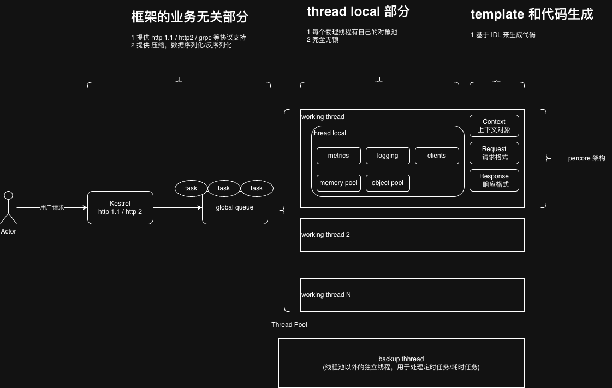

<h1>[WIP] QiWa (七娃) </h1>

# 为什么叫七娃 QiWa

QiWa, in Chinese, that means the Seventh Fairy Super Power Child.


----

在《金刚葫芦娃》中，从大娃开始，一个接一个去救爷爷，又一个又一个被妖怪抓住。
七娃可能是最没存在感的那个！实际上后面几个娃有什么特点已经忘记了……剧情很明显，强如大娃都被妖怪抓住了，七娃肯定是一样的命运。
可是，七娃并没有因此就放水，他一样很努力。
此外，紫色的七娃，符合微软风格的配色，符合后端程序员这个很基的群体的色彩喜好。

在微服务开放的框架方面，tokio 真的很强，而 golang 的各种框架真的很好用且性能也不差。
相比之下， C# 在云时代真的落后了。
进入这个网址: https://www.techempower.com/benchmarks/#section=data-r23, 里面是各种 web 服务框架的性能排名。C# 语音实现的 aspnetcore 排行 35 位。



C# 曾经是我刚工作时最喜欢的语言。时隔20多年要再次使用这个语言工作，很多感慨。
在云时代，C# 的设计理念已经不如 Rust/golang 这样的更加现代化的语言。

因此，我打算反向抄袭，把 golang 领域的经验应用到 C# 上，基于 C# 实现一个高性能的微服务框架。
C# 实现了一个高性能的 Http1/http2 的服务器 Kestrel 【红隼/（产于欧洲的）茶隼 sūn 】.
因此这是一个 七娃 加上 红隼 的组合，本项目的官方图标如下：


# 目标

以下是我的目标：
* 使用 C#， 以 DotNetCore 库提供的 Kestrel 为基础，实现一款性能尚可的、可以支撑简单业务开发的微服务框架。
  - 主要开发语言是 C#
  - 面向 linux amd64 的服务器平台
  - 面向业务相对简单，且 qps 在 100 万 /s 左右规模的业务
* 完全以 async/await 模式的非阻塞来实现，利用无栈协程实现高性能
* C# 语言细节：
  - 全面模仿 golang，完全不遵循任何面向对象的条款。一切为了简单 + 高性能
  - 尽量基于值类型而不是引用类型。也就是说，明明可以写个 class，偏偏要写成 struct
  - 不使用 try catch，仅在协程的入口处加一个 try finally。完全模仿 golang 一样 error 返回值机制。
  - API接口等，使用 out/ref 参数来使用外部提供的对象。便于框架内使用内存池。
  - 使用值类型的组合，使用泛型。避免引用类型，避免继承
  - 编译期决定，而不是运行期决定。使用泛型是个好主意，避免使用各种复杂的接口/虚类/基类。
* CPU 方面：
  - 使用 ThreadPool.SetMaxThreads(core_count - 1) 来限制物理线程数。
    - 进一步：当程序在 ThreadPool.SetMaxThreads(1) 的情况下测试时，其性能表现应该符合 1 核的极限值。否则证明 async 机制可能存在阻塞。
  - 使用 async/await 完成大多数业务逻辑。会阻塞的部分分配独立物理线程，通过 channel 来通讯。
  - 使用一定的 cache line 对齐来优化性能
  - 尽量避免使用锁
  - ThreadLocal 是另一个好主意：为每个物理线程分配对象，完全绕开加锁。
  - 在 20 核的容器环境中运行，不会有严重的性能劣化。
    - 避免因为加锁等问题，导致了容器只能在很少的核上运行。
* 内存方面：
  - GC 友好。 GC 是最大的性能杀手，重点优化 GC.
  - 核心的 hot path 上做到 0 alloc，大量使用内存池
  - 使用 struct 存放数据，使用栈内存分配，使用 ref 的方式避免拷贝。
  - 空间换时间，尽量使用内存池/对象池
    - 对象池， 使用 ObjectPool
    - 连接池
  - 使用 context 对象，会造成内存分配的部分都提前在 context 中定义成员。在请求开始时，从内存池获得 context 对象，请求结束后放回 context 对象。
* 异常处理：
  - 基于 tuple 来做多返回值。不使用任何的 try catch (模仿 golang 的 error 对象)
  - try finnaly 是特例，可以使用
  - 不使用任何含有 throw 语句的函数或方法
    - 如果第三方库含有 throw，则立即使用 try-catch 包装。
* 支持的组件方面:
  - 不是做大而全的功能支持。仅支持常见的后端组件，主要是 redis 和 mysql
  - 提供 http 1.1 / http 2 / grpc 等协议的客户端，并封装为对应的连接池
* local cache:
  - 模仿 golang 的 fast cache, 提供 gc 友好的堆外内存的 cache
* 协议支持：
  - 可以同时使用 http 1.1 / http 2 / grpc 三种协议
  - 不必使用复杂的 grpc 框架，仅仅基于 http 2 的框架就足够
* 数据序列化:
  - 支持 JSON 和 protocol buffers 两种数据序列化模式
  - 引入性能最高的 SIMD JSON 来提升 JSON 性能
  - 提供更加现代化的 protocol buffers 的 git 仓库管理模式
    - buf 项目
* 数据压缩:
  - 默认所有的文本协议都使用 gzip 压缩
  - 所有的二进制协议都使用 zstd 压缩
  - 压缩总是有收益的，默认总是使用压缩
* 配置管理:
  - todo: 引入更加先进的配置管理方式
  - 核心配置项都可以使用命令行传入
  - 考虑引入群集内的配置中心的服务，以此简化配置的管理
* 可观测性:
  - metrics:
    - 实现一个高性能的 metrics 组件，提供 counter, gauge, histogram 三种类型
    - 提供 /proc/self/ 下的 linux 指标的上报
    - 提供 DotNet runtime 的上报
    - 提供 /metrics 路径的 exporter
    - 自动进行请求量，错误量，延迟分布的上报
    - 自动进行 caller - callee 之间的请求量/错误量/延迟分布的上报
  - logging:  
    - 模仿 uber zaplog 组件，提供没有栈逃逸的 log tag
    - 日志先追加到内存buffer，积累到一定的量再输出到 stdout
    - 日志始终向一个大的 buffer 追加，避免拷贝
    - 请求开始时，通过 context 产生对应的 logger 对象，以便打印公共字段
    - 使用 thread local, 以此来避免加锁
    - 始终输出 json 格式日志
  - 封装 trace 功能
* profiling:
  - 提供一定的 profiling 能力
  - 最好是 golang 一样的在线 profiling 能力
* k8s 环境融合:
  - 提供 /health 接口
  - 提供 graceful shutdown
* 大语言模型友好：
  - 增加接口等，可以通过约定的提示词，让大语言模型来帮助增加代码。
  - 大多数的任务都可以通过提示词完成。
* 脚手架
  - 基础代码可以用工具生成
* 库：
  - 依赖管理的规范  
* 单元测试
  - 达到至少 80% 的单元覆盖测试率
* benchmark 支持
* 代码覆盖率支持
* 工具:
  - 代码格式化工具
  - 代码 lint 工具
  - 静态代码扫描
* IDL 与代码生成
  - 提供协议库的 git 管理规范
  - 考虑引入 buf 这个项目：https://github.com/bufbuild/buf
  - 提供代码生成工具，定义 service 后，就会生成对应的代码
  - 使用 switch case '/path' 的模式来处理路由，在编译期就提供高性能的路由转发
  - 协议设计
    - 协议中有 caller 的字段，方便进行 debug
* 过载保护
  - 背压(back presure)支持，拒绝无法处理的请求
* utf-8 string
  - 全部基于 utf-8 string 来处理。避免频繁的 utf-8 / utf-16 的转换

```csharp
/// 这是一个业务函数回调的样式
/// @param ctx, req, rsp 三个参数都来自于内存池的 struct
/// 框架中可以做到 0 alloc
public void OnRequest(ref QiWaContext ctx, in ReqestStruct req, ref ResponseStruct rsp){}

// 代码生成工具，为每个 service 的每个 method 都生成 context 类
public struct HelloWorldContext{
  // Context 类的前面两个成员是 request 格式和 response 格式
  HelloWorldRequest req;
  HelloWorldResponse rsp;
  // todo: 所有业务处理函数内的会引起堆内存分配的部分，都会在 context 中定义。
  // 从而：做到整个业务在处理过程中做到 0 alloc
}

```

# 设计



## 线程模型
* 使用 ThreadPool.SetMaxThreads(core - 1) 来作为线程数
* 因为 Kestrel 框架底层依赖线程池，所以由于 CPU 核数匹配的物理线程来干活
