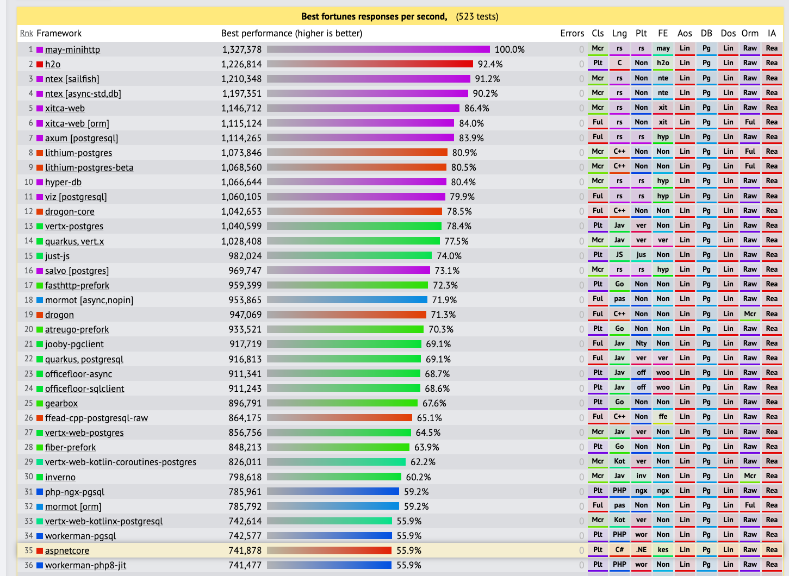
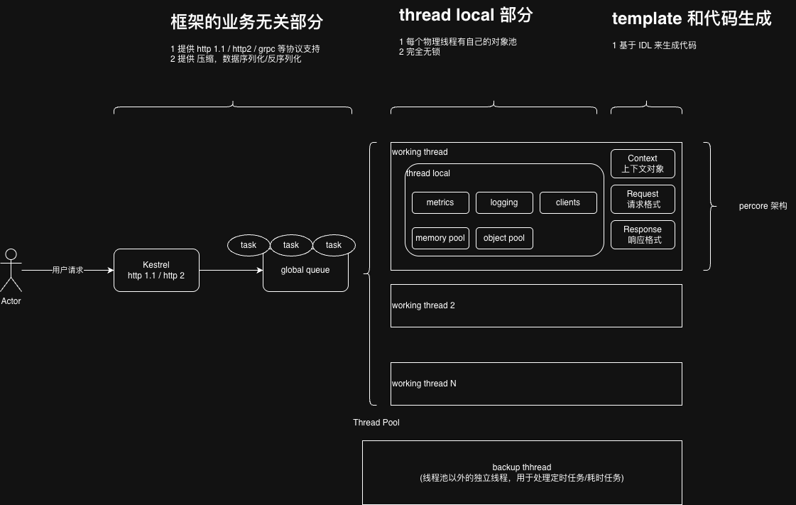
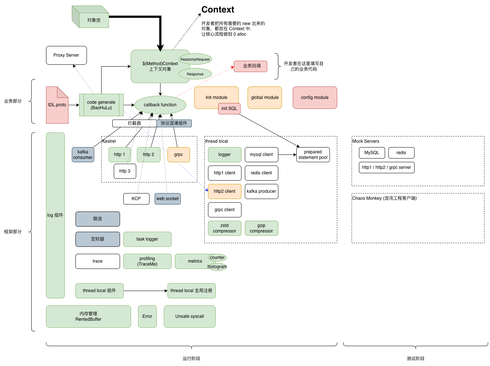

<h1>[WIP] QiWa (七娃) </h1>

A microservice framework implemented in C#. Easy to use, AI-friendly, and high-performance.

# 为什么叫七娃 QiWa

QiWa, in Chinese, that means the Seventh Super Power Fairchild.


----

> 在《金刚葫芦娃》中，从大娃开始，一个接一个去救爷爷，又一个又一个被妖怪抓住。
> 七娃可能是最没存在感的那个！实际上后面几个娃有什么特点已经忘记了……剧情很明显，强如大娃都被妖怪抓住了，七娃肯定是一样的命运。
> 可是，七娃并没有因此就放水，他一样很努力。
> 此外，紫色的七娃，符合微软风格的配色，符合后端程序员这个很基的群体的色彩喜好。(另一层意思是：专心当好老七，别想着争老六了！)

在微服务开放的框架方面，tokio(rust) 真的很强，而 golang 的各种框架真的很好用且性能也不差。
相比之下， C# 在云时代真的落后了。
进入这个网址: https://www.techempower.com/benchmarks/#section=data-r23, 里面是各种 web 服务框架的性能排名。C# 语音实现的 aspnetcore 排行 35 位。



C# 曾经是我刚工作时最喜欢的语言。时隔20多年要再次使用这个语言工作，很多感慨。
在云时代，C# 的设计理念已经不如 Rust/golang 这样的更加现代化的语言。

因此，我打算反向抄袭，把 golang 领域的经验应用到 C# 上，基于 C# 实现一个高性能的微服务框架。
C# 已经内置了一个高性能的 Http1/http2 的服务器 Kestrel 【红隼/（产于欧洲的）茶隼 sūn 】.
我在 Kestrel 的基础上包装上框架的能力，因此这是一个 `七娃` 加上 `红隼` 的组合，本项目的官方图标如下：


# 背景

公司的合作伙伴有一些直播平台的应用。在直播打赏环节的礼物扣减、或者类似高频交易的场景中，其性能表现很糟糕。直播平台及其合作伙伴使用 C# 作为主要开发语言，他们希望在业务流程、架构和 framework 等多个层面进行改进。
为此，我计划建设一个 C# 的后端框架，以便未来可以用到对性能要求苛刻的高频交易场景中。

# 设计理念

* 参考(并抄袭)所有 golang 中好的做法
* 基于 CLR 提供的并发模型来做顶层设计
  - aka: Kestrel + 全局队列 + 线程池 + Task + async/await
* 简单、直截了当、避免不必要的抽象
* 代码生成 + 编译期决定
* AI 友好

# 设计目标

TL;DR;

see: [设计目标](./doc/设计目标.md)

# 并发模型设计



* 沿用 Kestrel 框架中的全局 Task 队列和 ThreadPool
* 大多数公共对象使用 ThreadLocal 的模式
  - 最终达到类似 per core 架构的效果：几乎无锁
* 每个请求都会产生的对象，使用对象池来减少分配和 GC

# 项目结构

整个 QiWa 框架，由以下子项目构成：

* https://github.com/ahfuzhang/QiWa
  - 当前项目。对 QiWa 微服务框架进行整体的介绍
  - 包括：设计思想、设计目标、功能介绍、文档等
* https://github.com/ahfuzhang/QiWa.Common
  - 最基本的公共定义
  - Error 对象：类似 golang 中的 error 对象。通过返回错误对象来代替使用 throw 语句。
  - RentedBuffer 对象：类似 golang 的 []byte，类似 C# 的 List<T>，但是底层使用 ThreadLocal 的借用数组，可以避免 GC，避免数组清零。是一种高性能的内存分配方式。
  - ProtobufUtils: 提供 protobuf 序列化/反序列化中的工具函数
  - IResetable 接口：定义 Reset() 方法，方便对象清空自身，以便于通过内存池实现重用。
* https://github.com/ahfuzhang/QiWa.framework
  - QiWa 的网络框架的基类和各种组件。（依赖 QiWa.Common）
  - QiWa.ConsoleLogger: 模仿 golang 的 ZapLog，实现高性能的 JSON 日志输出
  - QiWa.KestrelWrap: 对 Kestrel 框架进行包装，以便简化网络服务器的开发。
  - QiWa.Compress: 对 gzip 和 zstd 库的封装
* https://github.com/ahfuzhang/BaoHuLu
  - 根据 protobuf 的 *.proto 文件生成 C#/golang 代码的命令行工具
  - 目前在 protobuf/JSON + C#/golang 方面，能生成【全世界性能第一】的 数据序列化/反序列化 代码
  - 支持 golang 语法的代码模版，可以进一步生成 RPC 服务器/客户端/代理的代码
* https://github.com/ahfuzhang/QiWa.DemoServer
  - 一个支持 http1/http2/grpc 的 API 服务器的 Demo
  - 演示：代码生成 + 框架 + 脚手架 如何协同工作

# 框架组件图



* 色彩含义：
  - 绿色：已经实现
  - 黄色：开发中
  - 红色：需要使用者自己开发
  - 白色：还未开始开发
  - 灰色：暂不打算实现

# How to use

## 1. 定义 proto 文件

需要以 protobuf 的语法来定义：
* 请求格式
* 响应格式
* 服务
  - 服务下面的每个 rpc 方法

其中，可以通过注释 `// @指令=值 ` 的方式来使用扩展语法。
具体请见：[Extensions](https://github.com/ahfuzhang/BaoHuLu/blob/main/doc/Extensions.md)

## 2. 生成 message 代码

message 一般用于定义请求格式、响应格式。
使用代码生成工具，可以把 .proto 文件生成对应的 message 定义的代码。

```bash
hulu generate -src=xx.proto -csharp_out=./dir/
```

工具地址为：https://github.com/ahfuzhang/BaoHuLu

每个 message 都会生成 json 和 protobuf 的序列化/反序列化函数：
* JSON:
  - FromJSON() 反序列化成员函数
  - ToJSON() 序列化成员函数
* protobuf
  - FromProtobuf() 反序列化成员函数  
  - ToProtobuf() 序列化成员函数  

## 3. 生成 rpc 服务器代码

框架提供了基本的 rpc 服务器的代码模版，使用了 golang template 的语法。
开发者也可以基于这个模板来修改成自己的代码模版。

同样，通过工具，按照 proto 文件中定义的 service 来生成代码：

```bash
hulu generate \
	  -src=./proto/Demo.proto \
	  -csharp_out=./generated/Demo/ \
	  -csharp_out.with.test \
	  -src.csharp_template.dir=./templates/QiWa.rpc/ \
	  -dst.csharp_template.out_dir=./generated/Demo/
```

## 4. 仿照 DemoServer，进行初始化

see: https://github.com/ahfuzhang/QiWa.DemoServer

(未来会提供生成 server 的命令行工具)

## 5. 在 ${method}Context 类中填写业务逻辑

see: https://github.com/ahfuzhang/QiWa.DemoServer/blob/main/generated/Demo/Demo.GetUserInfoContext__rename.cs

## License

This project is licensed under the [MIT License](LICENSE).

Copyright (c) 2026 Fuchun Zhang
